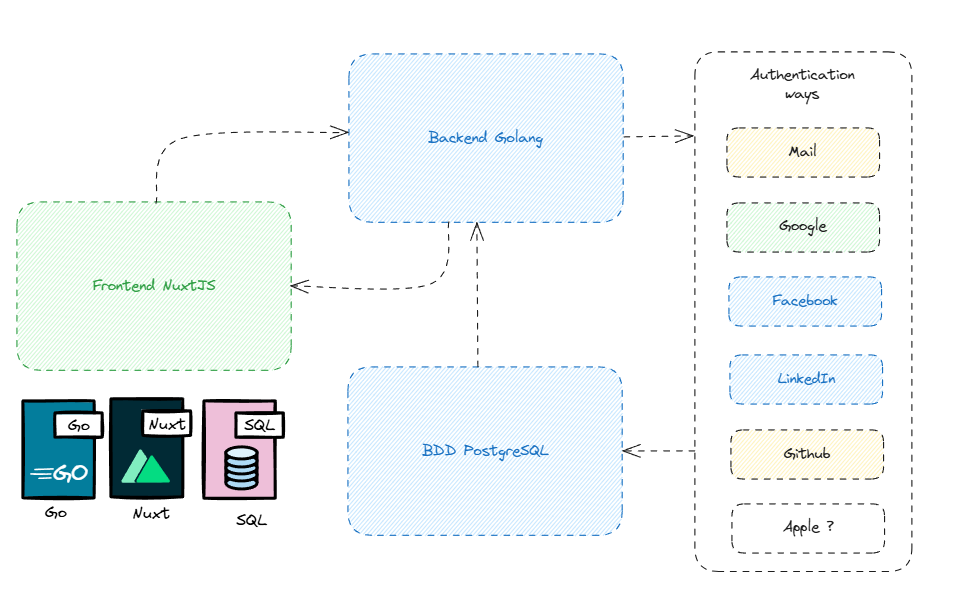

# Auth System Template

A standardized authentication system template with Golang backend, Nuxt 3 frontend, and PostgreSQL database. This template provides a modern, responsive authentication solution that works seamlessly across desktop and mobile devices.



## Features

- Full-stack authentication system
- Golang backend with Fiber framework
- Nuxt 3 frontend with responsive design
- PostgreSQL database
- JWT authentication
- Multiple authentication providers:
  - Google
  - LinkedIn 
  - Facebook
  - GitHub
  - Email/Password
  - Not Apple because not free

## Project Structure

```bash
Auth-System/
├── Auth-System-Back/
│   ├── controllers/
│   │   ├── authController.go
│   │   ├── google.go
│   │   ├── facebook.go
│   │   ├── linkedin.go
│   │   └── github.go
│   ├── database/
│   │   └── connection.go
│   ├── models/
│   │   └── user.go
│   ├── routes/
│   │   └── routes.go
│   ├── main.go
│   └── .env
│
└── Auth-System-Front/
    ├── components/
    │   ├── auth/
    │   │   ├── LoginForm.vue
    │   │   ├── SignIn.vue
    │   │   └── Button.vue
    │   └── landing/
    │       ├── Link.vue
    │       └── Navbar.vue
    ├── layouts/
    │   └── landing.vue
    ├── middleware/
    │   └── guard.ts
    ├── pages/
    │   ├── auth/
    │   │   └── callback.vue
    │   ├── index.vue
    │   ├── login.vue
    │   ├── register.vue
    │   └── only-authenticated.vue
    ├── stores/
    │   └── auth.ts
    ├── nuxt.config.ts
    ├── package.json
    └── .env
```

## Quick Start

### Prerequisites

- Go 1.20+
- Node.js 16+
- PostgreSQL
- Docker (optional)

### Quick Start with Make

```bash
# Install dependencies and start servers
make

# Only install dependencies
make install

# Only start servers
make start

# Build for production
make build

# Clean project
make clean
```

### Backend Setup

```bash
cd Auth-System-Back
go mod download
go run main.go
```

### Frontend  Setup

```bash
cd Auth-System-Front
npm install
npm run dev
```

### Database Setup

1. Create a PostgreSQL database
2. Configure database connection in .env file
3. Run migrations

### Configuration

Create a .env file in both frontend and backend directories:
# Backend .env

```bash
GOOGLE_CLIENT_ID='your_client_id'
GOOGLE_CLIENT_SECRET='your_client_secret'
GOOGLE_REDIRECT_URI='your_backend_authorized_uri' (example: 'http://localhost:8000/auth/google/callback')

LINKEDIN_CLIENT_ID='your_client_id'
LINKEDIN_CLIENT_SECRET='your_client_secret'
LINKEDIN_REDIRECT_URI='your_backend_authorized_uri' (example: 'http://localhost:8000/auth/linkedin/callback')

GITHUB_CLIENT_ID='your_client_id'
GITHUB_CLIENT_SECRET='your_client_secret'
GITHUB_REDIRECT_URI='your_backend_authorized_uri' (example: 'http://localhost:8000/auth/github/callback')

FACEBOOK_CLIENT_ID='your_client_id'
FACEBOOK_CLIENT_SECRET='your_client_secret'
FACEBOOK_REDIRECT_URI='your_backend_authorized_uri' (example: 'http://localhost:8000/auth/facebook/callback')

DB_HOST='localhost'
DB_USER='postgres'
DB_PASSWORD='admin'
DB_NAME='auth-system'
DB_PORT='5432'

FRONTEND_URL='http://localhost:3000'

SERVER_PORT=':8000'

SECRET_KEY='secret'

SIMPLE_USERNAME='admin'
SIMPLE_PASSWORD='admin'
```


# Frontend .env

```bash
NUXT_PUBLIC_API_BASE=http://localhost:8000
GOOGLE_CLIENT_ID='your_client_id'
LINKEDIN_CLIENT_ID='your_client_id'
GITHUB_CLIENT_ID='your_client_id'
FACEBOOK_CLIENT_ID='your_client_id'
```

### Configuration

Create New Project
```bash
auth-system create \
  --google \
  --linkedin \
  --facebook \
  --github \
  --email \
  --name my-auth-project
  ```


### Contributing
1. Fork the repository
2. Create your feature branch
3. Commit your changes
4. Push to the branch
5. Create a Pull Request

### License
MIT License

Author
Moi


This README provides:
1. Overview of the project
2. Key features
3. Project structure
4. Setup instructions
5. Configuration details
6. Usage example
7. Contributing guidelines

You can customize it further based on specific requirements or additional features you may add to the template.
This README provides:
1. Overview of the project
2. Key features
3. Project structure
4. Setup instructions
5. Configuration details
6. Usage example
7. Contributing guidelines

You can customize it further based on specific requirements or additional features you may add to the template.